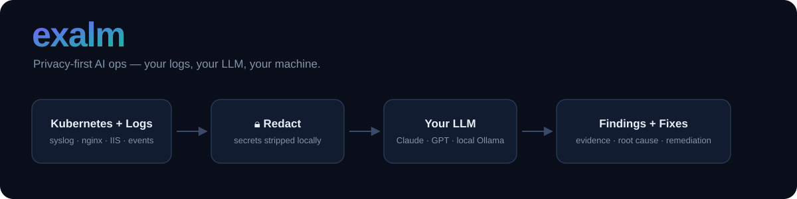
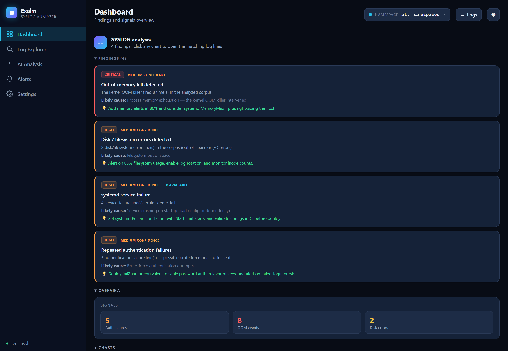

<div align="center">


# exalm

**The privacy-first AI ops assistant for DevOps engineers, SREs, and sysadmins.**

Secrets never leave your machine. Your LLM. Your cluster. Your data.

[](https://github.com/exalm-ai/exalm/actions/workflows/ci.yml)
[](LICENSE)
[](go.mod)
[](https://github.com/exalm-ai/exalm/releases)
[](https://goreportcard.com/report/github.com/exalm-ai/exalm)

</div>

---

`exalm` is an open-source CLI that diagnoses infrastructure problems using the LLM of your choice — without sending raw logs, secrets, or environment data to anyone.

It reads Kubernetes cluster state, Linux and Windows logs, AWS cost anomalies, Terraform plans, DORA metrics, and incident history. It strips secrets before any data reaches an LLM. It returns structured diagnostic reports.

**Single static binary. No agents. No cloud account required.**

<div align="center">



</div>

---

## See it in action

Exalm runs as a CLI or opens a local web dashboard (`--output web`) with a
findings panel, a log explorer, timelines, and a conversational AI
investigation workspace.

<!--
  The demo GIF and dashboard screenshots are generated reproducibly from the
  real tool (no mockups) — see docs/screenshots.md. After running the commands
  there, uncomment the two lines below and commit the generated assets:

  
  
-->

**Generate the visuals** (deterministic, no API key — uses the mock provider):

```bash
# Terminal GIF of `exalm syslog analyze` (Charm vhs)
vhs docs/assets/demo.tape                       # → docs/assets/demo.gif

# Dashboard PNG (shot-scraper / Playwright)
EXALM_LLM_PROVIDER=mock exalm syslog analyze --file examples/syslog/wsl-live-session.jsonl --output web &
shot-scraper http://localhost:7433 -o docs/assets/dashboard.png --width 1360 --wait 1500 --retina
```

Full guide, alternatives (asciinema, silicon), and the recommended shot list:
[docs/screenshots.md](docs/screenshots.md).

---

## Quickstart

### 1. Install

**macOS / Linux (go install)**
```sh
go install github.com/exalm-ai/exalm/cmd/exalm@latest
```

**macOS (Homebrew)**
```sh
brew install exalm-ai/tap/exalm
```

**Linux (pre-built binary)**
```sh
curl -sSL https://github.com/exalm-ai/exalm/releases/latest/download/exalm_linux_amd64.tar.gz \
  | tar xz && sudo mv exalm /usr/local/bin/
```

**Docker**
```sh
docker run --rm -it \
  -e ANTHROPIC_API_KEY=$ANTHROPIC_API_KEY \
  -v ~/.kube:/home/nonroot/.kube:ro \
  ghcr.io/exalm-ai/exalm:latest k8s analyze
```

### 2. Run the setup wizard first

```sh
exalm init
```

`exalm init` checks your LLM key, Kubernetes context, data directory, and dashboard token
before you run anything else. It tells you exactly what is missing and how to fix it.

### 3. Analyze your cluster

```sh
# Set your LLM provider — Claude shown; OpenAI, Ollama, OpenRouter also supported
export ANTHROPIC_API_KEY=sk-ant-...
export EXALM_LLM_PROVIDER=claude

# Kubernetes diagnostic
exalm k8s analyze

# Linux syslog (local file)
exalm syslog analyze --file /var/log/syslog

# Any log source via stdin
kubectl logs -l app=api --since=1h | exalm logs summarize
```

---

## Plugins

### Infrastructure

| Command | What it does |
|---|---|
| `exalm k8s analyze` | Pod crash diagnosis, event correlation, ArgoCD / Helm IaC change detection |
| `exalm k8s analyze --namespace kube-system` | Analyse a specific namespace |
| `exalm chaos suggest` | Resilience score (0–100) per service + Litmus ChaosEngine YAML |
| `exalm slo check` | Multi-window burn-rate SLO analysis (1h / 6h / 72h) |

### Log analysis

| Command | What it does |
|---|---|
| `exalm logs summarize` | Root-cause analysis from any log (stdin or `--file`) |
| `exalm syslog analyze` | Linux syslog — local file or remote via `--host` (SSH, no agent) |
| `exalm httplog analyze` | nginx / Apache access log — local or SSH remote |
| `exalm eventlog summarize` | Windows Event Log — remote via SSH |
| `exalm iis analyze` | IIS W3C log — local or SSH remote |

### Cloud & infrastructure-as-code

| Command | What it does |
|---|---|
| `exalm aws cost` | AWS Cost Explorer anomaly detection and spend analysis |
| `exalm cloudtrail analyze` | AWS CloudTrail activity — root usage, denials, deletions, privilege escalation |
| `exalm tf review` | Terraform plan JSON security and risk analysis |
| `exalm webhook terraform` | Receive Terraform Cloud apply webhooks → auto-populate DORA |

### Incident management & DORA

| Command | What it does |
|---|---|
| `exalm incident open` | Open a new incident |
| `exalm incident list` | List open and recent incidents |
| `exalm incident close` | Close an incident with resolution notes |
| `exalm incident postmortem` | LLM-assisted blameless postmortem (timeline redacted before send) |
| `exalm dora report` | Four-key DORA metrics: Deployment Frequency, Lead Time, CFR, MTTR |
| `exalm dora log-deploy` | Record a deployment for DORA tracking |

### Interfaces

| Command | What it does |
|---|---|
| `exalm serve` | Web dashboard: findings, DORA metrics, cross-signal timeline |
| `exalm tui` | Interactive terminal UI |
| `exalm notify slack` | Post an analysis report to a Slack webhook |
| `exalm usage` | Show LLM token usage statistics by provider |

---

## SSH remote log collection

All log plugins collect from remote hosts over SSH — no agent, no daemon, no port other
than 22 required on the target.

```sh
# Linux syslog
exalm syslog analyze --host db-01 --ssh-key ~/.ssh/id_rsa

# nginx access log from a remote web server
exalm httplog analyze --host web-01 --ssh-user deploy

# Windows Event Log (requires OpenSSH for Windows on the target)
exalm eventlog summarize --host dc-01 --log-name Security

# IIS W3C logs
exalm iis analyze --host iis-01 --log-dir 'C:\inetpub\logs\LogFiles\W3SVC1'
```

| Flag | Default | Description |
|---|---|---|
| `--host` | — | Remote hostname or IP |
| `--ssh-user` | current OS user | SSH username |
| `--ssh-key` | `~/.ssh/id_rsa` | Path to PEM private key |
| `--ssh-port` | `22` | SSH port |

**Host-key verification:** exalm uses trust-on-first-use (TOFU) — the first connection
stores the key fingerprint at `~/.exalm/known_hosts`. Subsequent connections verify it.
A fingerprint mismatch stops the connection before any data is exchanged.

**Remote diagnostics:** during an AI investigation (see below), exalm can run a small,
fixed set of read-only commands on the remote host — disk/memory/uptime, service status,
journal/event log excerpts, and similar — to answer questions like "is memory the real
problem?" without another SSH round trip from you. Every command comes from a reviewed
allowlist in `internal/ssh/diagnostics.go`; the LLM never chooses or writes a command.

| Tier | Unlocks |
|---|---|
| `off` | No remote commands — investigation reasons over the collected logs only |
| `readonly` (default) | Disk/memory/uptime, service status, journal/event excerpts, IIS app pools |
| `full` | Also: auth logs, login history, firewall state, certificate expiry, scheduled tasks |

Set with `--remote-diag off\|readonly\|full` per run, or `EXALM_REMOTE_DIAG` globally.

---

## AI investigation

Every analyzer — Kubernetes, `syslog`, `httplog`, `eventlog`, `iis`, and `logs` — shares
one investigation experience: ask a question in plain language and get evidence-backed
root cause analysis, a numeric confidence score with its rationale, a chronological
timeline, tiered remediation (immediate mitigation → root-cause fix → prevention), and
automatic follow-up questions — all persisted so the conversation continues across
reloads.

```sh
# Analyze, then open the AI investigation dashboard
exalm syslog analyze --host db-01 --open
exalm httplog analyze --file /var/log/nginx/access.log --open
exalm k8s analyze --open
```

Ask things like "why is this failing?", "what changed recently?", "is memory the real
problem?", or "generate an RCA" — every answer cites the exact evidence it used (click to
expand), and every chart on the dashboard drills down into the matching raw log lines.
Export the investigation as Markdown, JSON, or a standalone HTML report (PDF via your
browser's print dialog).

One redacted LLM call happens per turn; the assistant never picks which diagnostics run —
that's always the deterministic planner above.

---

## Web dashboard

`exalm serve` is a multi-dashboard hub: one process hosts every enabled dashboard —
Kubernetes findings, DORA, the cross-signal timeline, incidents, and a dashboard per
log analyzer. Navigation builds itself from the enabled plugins, Grafana-style.

```sh
# Start the hub
exalm serve --token $EXALM_TOKEN

# While it runs, any analysis with --open ATTACHES to it instead of
# starting a second server — its dashboard lights up in the hub nav.
exalm syslog analyze --host db-01 --open
exalm httplog analyze --file /var/log/nginx/access.log --open
```

Open `http://localhost:7433`. The hub includes:

- **Per-analyzer dashboards** — widgets adapted to each source (severity timelines,
  status codes, top units/URLs/clients, auth/OOM/reboot signals); every chart drills
  into the matching log lines or seeds an AI investigation
- **AI investigation** — conversational root cause analysis on every dashboard
- **Findings view** — severity-filtered k8s findings with remediation steps
- **DORA dashboard** — four-key metrics with deployment history
- **Cross-signal timeline** — k8s findings, IaC changes, and incidents on a shared time axis
- **Settings** — enable/disable dashboards and AI features, persisted at `~/.exalm/settings.json`
- **`/metrics`** — Prometheus endpoint
- **`/healthz`** — Kubernetes liveness probe endpoint

Attached sessions never carry SSH credentials — the hub can't run remote diagnostics
on them (corpus-only investigation); run the analyzer standalone when you want live
remote checks. The dashboard binds to `localhost` by default. Pass `--token` or set
`EXALM_TOKEN` to require Bearer token authentication. Do not expose the dashboard
without TLS termination.

---

## Kubernetes deployment via Helm

```sh
helm repo add exalm https://charts.exalm.com
helm install exalm exalm/exalm-agent \
    --create-namespace \
    --namespace exalm \
    --set llm.provider=claude \
    --set llm.apiKey=$ANTHROPIC_API_KEY

kubectl -n exalm port-forward svc/exalm-exalm-agent 7433:7433
# open http://localhost:7433
```

Key chart values:

```yaml
llm:
  provider: claude          # claude | openai | openrouter | ollama
  model: ""                 # override provider default
  existingSecret: ""        # use a pre-existing Kubernetes Secret instead of apiKey

rbac:
  allowApply: false         # enable mutating operations from within the pod

persistence:
  enabled: true             # persist DORA and incident data across pod restarts
  size: 1Gi

auth:
  token: ""                 # dashboard Bearer token (use existingSecret in production)
```

Full values reference and sealed-secrets / External Secrets Operator setup:
[`deploy/helm/exalm-agent/README.md`](deploy/helm/exalm-agent/README.md)

---

## MCP integration (Claude Desktop)

exalm implements the [Model Context Protocol](https://modelcontextprotocol.io), letting
Claude Desktop and other MCP agents query exalm's findings and apply remediations
directly from a conversation.

```sh
# 1. Produce a report to serve
exalm k8s analyze --output json > report.json

# 2. Serve it (read-only, stdio)
exalm mcp serve --file report.json
```

Add to `~/Library/Application Support/Claude/claude_desktop_config.json`:

```json
{
  "mcpServers": {
    "exalm": {
      "command": "exalm",
      "args": ["mcp", "serve", "--file", "/absolute/path/report.json"]
    }
  }
}
```

Restart Claude Desktop. You can now ask: _"What are the critical findings, and which
can be auto-fixed?"_ and Claude will call exalm's tools directly. Add `--write` (plus a
`--kubeconfig`) to let Claude apply k8s remediations.

Full walkthrough — read tools, write mode, SSE transport, safety model:
[docs/mcp.md](docs/mcp.md).

All six log analyzers (syslog, httplog, eventlog, iis, logs, cloudtrail) also
emit structured findings, and syslog/eventlog/iis can propose and apply
service-restart fixes over SSH — see
[docs/analyzer-remediation.md](docs/analyzer-remediation.md).

---

## LLM providers

| Provider | Set-up | Notes |
|---|---|---|
| **Claude** (Anthropic) | `export ANTHROPIC_API_KEY=sk-ant-...` | Default model: `claude-sonnet-4-6` |
| **OpenAI** | `export OPENAI_API_KEY=sk-...` | Default model: `gpt-4o` |
| **OpenRouter** | `export OPENROUTER_API_KEY=sk-or-...` | 100+ models; optimise cost per analysis |
| **Ollama** | `ollama serve` running locally | Air-gapped; `EXALM_OLLAMA_URL=http://localhost:11434` |

```sh
export EXALM_LLM_PROVIDER=openrouter
export OPENROUTER_API_KEY=sk-or-...
export EXALM_LLM_MODEL=meta-llama/llama-3.3-70b-instruct  # optional override

exalm k8s analyze
```

---

## Security and privacy model

**Secret redaction is the trust foundation of exalm.** Every byte of environment data
passes through the redaction engine before it reaches an LLM. This is enforced at the
architecture level — there is no flag to bypass it and no code path that skips it.

**What gets redacted (28+ patterns):**

- AWS, GCP, and Azure access keys
- Anthropic, OpenAI, OpenRouter, Stripe, and Twilio API keys
- Bearer tokens and Authorization headers
- Private key blocks (RSA, EC, OpenSSH, PKCS8)
- JWT tokens
- Password fields (`password=`, `passwd:`, `PGPASSWORD`, `DB_PASSWORD`, ...)
- Database connection strings (`postgres://`, `mysql://`, `mongodb://`, ...)
- IP addresses and email addresses (opt-in — off by default)

The full pattern list is in [`internal/redact/patterns.go`](internal/redact/patterns.go).
Every pattern has a corresponding test in
[`internal/redact/redact_test.go`](internal/redact/redact_test.go).

**Read-only by default.** Mutating operations require `--apply` and a confirmation prompt.
This is enforced at the plugin interface level.

**No telemetry.** exalm does not phone home. There are no plans to add telemetry without
an explicit opt-in flag.

**Responsible disclosure:** See [SECURITY.md](SECURITY.md). Redaction bypass reports
receive the highest priority response.

---

## Configuration reference

| Variable | Description | Default |
|---|---|---|
| `EXALM_LLM_PROVIDER` | `claude` / `openai` / `openrouter` / `ollama` | `ollama` |
| `EXALM_LLM_MODEL` | Override the provider's default model | — |
| `ANTHROPIC_API_KEY` | Anthropic API key | — |
| `OPENAI_API_KEY` | OpenAI API key | — |
| `OPENROUTER_API_KEY` | OpenRouter API key | — |
| `EXALM_OLLAMA_URL` | Ollama base URL | `http://localhost:11434` |
| `EXALM_OUTPUT` | Output format: `markdown` or `json` | `markdown` |
| `EXALM_TOKEN` | Dashboard and MCP server bearer token | — |
| `EXALM_SSH_PASSWORD` | SSH password authentication | — |
| `EXALM_REMOTE_DIAG` | Remote diagnostics tier: `off` / `readonly` / `full` (see [SSH remote log collection](#ssh-remote-log-collection)) | `readonly` |

Full reference: [docs/configuration.md](docs/configuration.md)

---

## Build from source

```sh
git clone https://github.com/exalm-ai/exalm.git
cd exalm
make build        # produces ./bin/exalm
make test         # unit tests + race detector (Linux/macOS)
make lint         # gofmt + go vet + golangci-lint
```

**Requirements:** Go 1.26+. No C toolchain — exalm uses a pure-Go SQLite driver.

---

## Roadmap

| Milestone | Status | What's included |
|---|---|---|
| **v0.1.0-beta** | ✅ Released | Plugin framework, k8s analysis, SSH collection, DORA, incidents, chaos scoring, web dashboard, Helm chart, MCP, SQLite store |
| **v0.2.0** | 🔄 In progress | JSON output on all plugins; PagerDuty / OpsGenie / Slack notification plugins; `--kubeconfig` flag |
| **v0.3.0** | 📋 Planned | LLM cost tracking; scheduled analysis (cron mode); PDF report export |
| **v0.4.0** | 📋 Planned | Community plugin registry; plugin SDK as standalone module |
| **v1.0.0** | 📋 Planned | Stable plugin API; PostgreSQL backend; multi-user team workspace |

[Open a feature request →](https://github.com/exalm-ai/exalm/issues/new/choose)

---

## Community

- [GitHub Discussions](https://github.com/exalm-ai/exalm/discussions) — questions, use cases, feature ideas
- [GitHub Issues](https://github.com/exalm-ai/exalm/issues) — bugs and feature requests
- [Security disclosures](SECURITY.md) — responsible disclosure process

---

## Contributing

The plugin interface is 3 methods. All existing plugins follow the same pattern.
Adding a new data source is a half-day of work.

See [CONTRIBUTOR_WORKFLOW.md](CONTRIBUTOR_WORKFLOW.md) for:
- Development environment setup
- Step-by-step guide to adding a new plugin
- Coding conventions
- PR checklist

---

## License

[Apache License 2.0](LICENSE)
